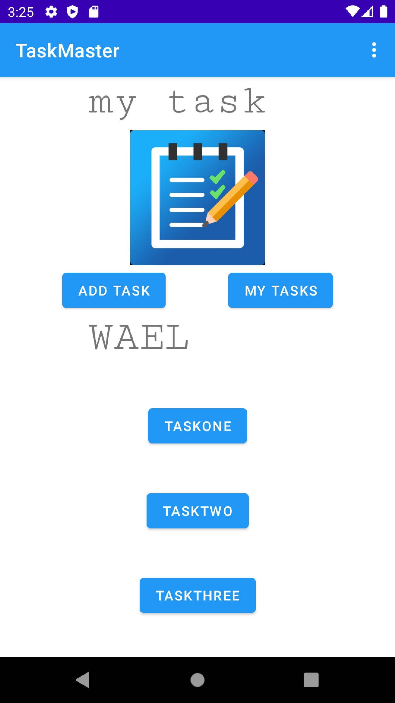
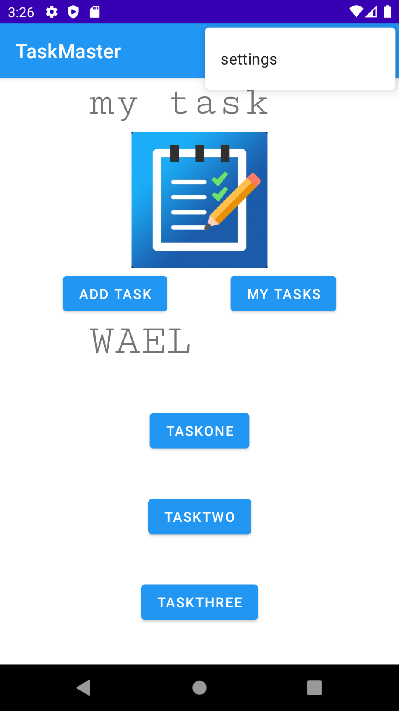
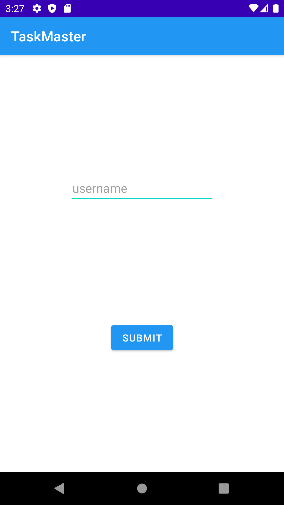
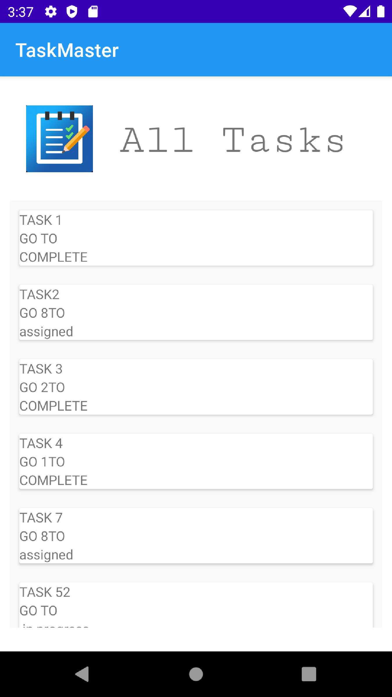
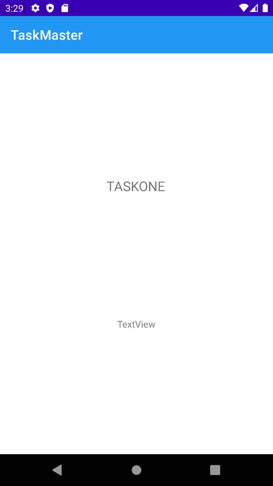

# Taskmaster
## Feature Tasks
This app for task manager to add tasks and mange it
### Homepage
The main page  have  buttons of the page to allow going to the “add tasks” and “all tasks” page.
, appear the username that the user can set it from setting
and the taskes of the user

### go to setting 
you can go to setting from menu

### setting
where can the user set the username

### Add a Task
On the “Add a Task” page, allow users to type in details about a new task, specifically a title and a body. When users click the “submit” button, show a “submitted!” label on the page.

### All Tasks

you can see all tasks and you can acess to any task you need the see the titles 

### Task deletes 
where the user can acces to it from home page
