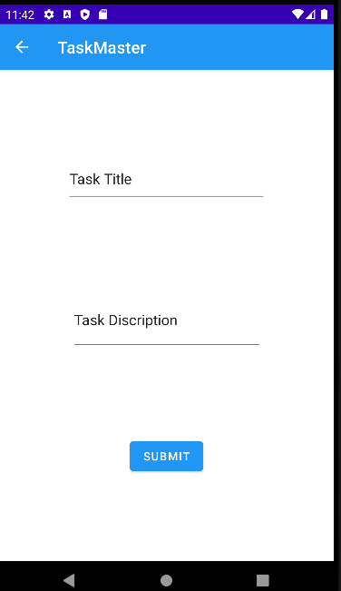

# Taskmaster
## Feature Tasks
This app for task manager to add tasks and mange it
### Homepage
The main page  have  buttons of the page to allow going to the “add tasks” and “all tasks” page.

### Add a Task
On the “Add a Task” page, allow users to type in details about a new task, specifically a title and a body. When users click the “submit” button, show a “submitted!” label on the page.

### All Tasks
