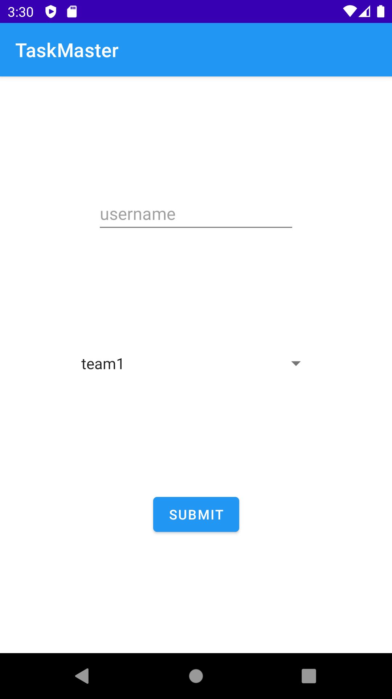

# Taskmaster
## Feature Tasks
This app for task manager to add tasks and mange it
### Homepage
The main page  have  buttons of the page to allow going to the “add tasks” and “all tasks” page.
, appear the username that the user can set it from setting
and the taskes of the user

### go to setting  and log out
you can go to setting or logout from menu

### setting
where can the user set the username

### Add a Task
- the user can add photo to task 
- On the “Add a Task” page, allow users to type in details about a new task, specifically a title and a body. When users click the “submit” button, show a “submitted!” label on the page.

### All Tasks

you can see all tasks and you can acess to any task you need the see the titles 

### Task deletes 
where the user can acces to it from home page and the user can see all data oof task   like the photo connect feom s3 AWS

###connect to AWS  DynamoDB 

the app conected with DynamoDB  to store and retrieve data from it

## sign up
- you can sign up in app the app connect with Amplify and Cognito to verify and sign up

## login
- login after signup

## SHEAR BY FILTER INTENT
- lSHEAR photo
  
  

## LOCATION
- Ask permission
  
- Show location
  
##AWS pinpoint

##AWS predictions Translate
- Before translation

- After translation

- you can translate by press on translate button
- you can speech by press on speech button
## Final AAB

[THE APK OF APP](amplify/app-debug.apk)

