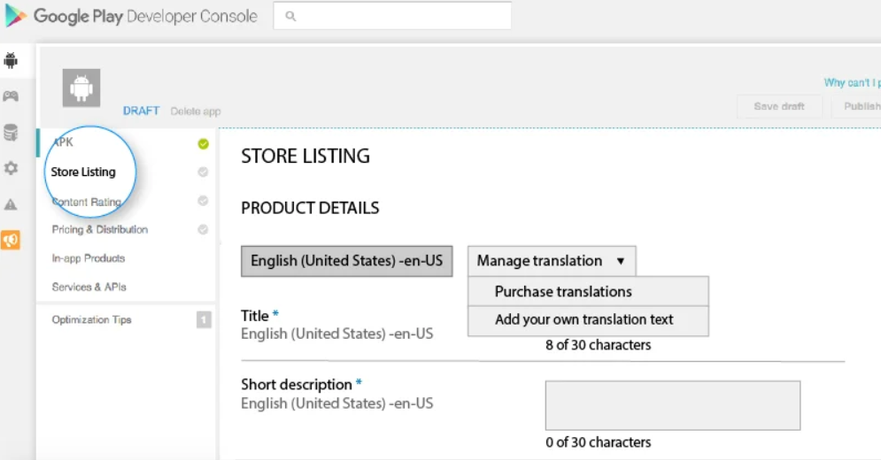

#How to deploy to play store

###  Preparing  app for release
- update  manifest and Gradle build  by chang the attributes
> android:versionCode 
> android:versionName 

### Build a release version of the  application.

### account PLAY
- if you don't have account create acount in google play by vistit [playSignup](https://play.google.com/console/signup/playSignup)
- after sign in click on create app

- select language and the title of app

- Fill out the  details

- Upload ABB to Google Play

